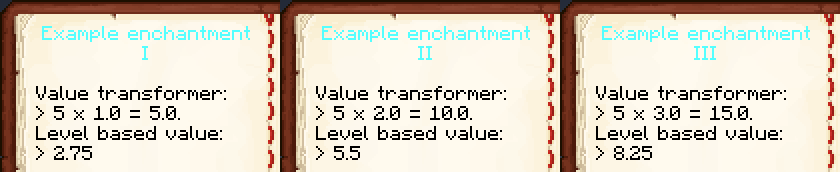
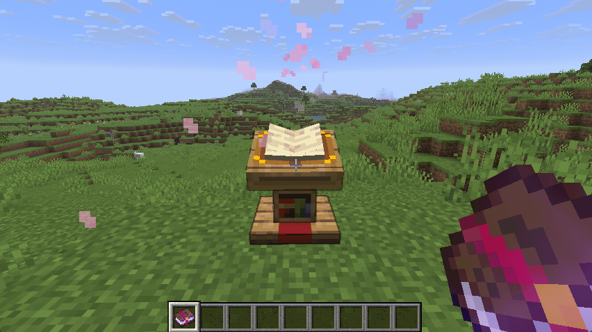
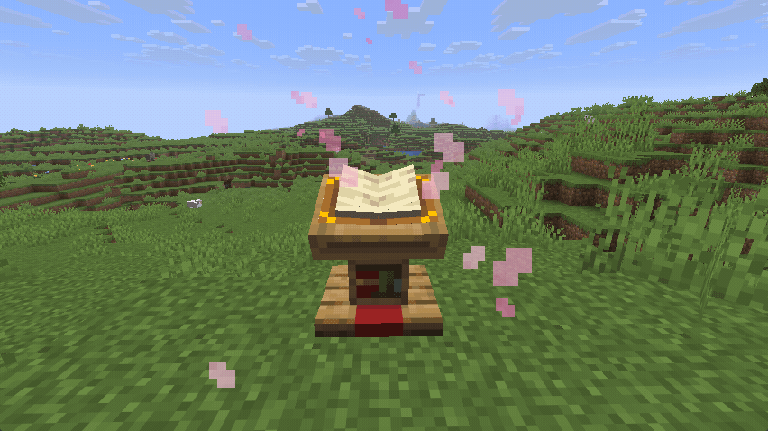

This repository demonstrates how custom enchantments can be integrated with the [Interactive Enchanted Books](https://github.com/Bristn/minecraft-interactive-enchanted-books) mod. The readme only describes the additional logic of integrating the custom enchantment and not how the enchantment is created.

# (Required) Adding a translation to an enchantment

There are 3 ways to add translations, each offering different tradeoffs. **Only one of them is necessary**

## Single descriptive translation

Provides a general description. Is compatible with [Enchantment Descriptions](https://modrinth.com/mod/enchantment-descriptions).

- Translation key: `enchantment.<mod_id>.<enchantment_id>.desc`
- Has the lowest priority, can be overwritten if there is a per level or named parameter key.

## Translation per level

To allow adding more detail to the translation, each enchantment level may have a separate translation key.

- Translation key: `enchantment.<mod_id>.<enchantment_id>.desc.level-<level>`
- Can be overwritten if there is a named parameter key.

## Translation using named parameters

To allow a more dynamic way of providing per level translations, named parameters may be used.

- Translation key: `enchantment.<mod_id>.<enchantment_id>.desc.level-x`
- Reads the enchantment level & effects of the enchantment definition. Uses **value transformers** to convert these values into human readable information

To add a named translation with a value transformer, follow the steps:

1. In your mod create the [file](./src/main/resources/assets/interactive_enchanted_books/data/enchantment_setting.jsonc) `resources/assets/interactive_enchanted_books/enchantment_setting.jsonc`
   - Note that the file is in the folder `interactive_enchanted_books`

2. Create a JSON object for every enchantment you wish to integrate
   - `enchantment` is the `Identifier` of the custom enchantment
   - `parameters` defines the different named parameters
   - (Optional) `particle` allows adding a custom particle effect

The `parameters` property being the most important one. This array can contain multiple names and formatters for each enchantment effect. The first element is always the enchantment level. The enchantment level is the easiest one to integrate, as the ordering of the other attributes depends on the enchantments json file. When opening the enchanted book in game, the ordering of the received attributes is logged.

- Log: ... LevelBasedValues: [3.0, 8.25], Named parameters: {level=3.0, knockback=8.25, exampleValue=15.0}
- In this the `3.0` is the enchantment level and `8.26` a value defined by the enchantment effect

The example parses the current enchantment level twice and formats them differently.

- Firstly the plain level is used with the name `level`. All occurrences of "{level}" in the translation string will be replaced with the actual enchantment level
- Secondly the enchantment level is used with a `transformer`. This is the `Identifier` of a custom callback that converts the level into an arbitrary number. In this case the level is just multiplied by 5 (see [ModTransformers](./src/main/java/net/bristn/interactive_enchanted_books_example/transformers/ModTransformers.java)). All occurrences of "{exampleValue}" in the translation string will be replaced with the value returned by the transformer.

# (Optional) Custom icon in "Applicable to"

If the custom enchantment is applied to modded items which are not covered by a default `TagKey<Item>` (like `swords`, `axes`, etc. ), this item will be displayed under the icon `Other`. To add a custom icon for a `TagKey<Item>`, follow the steps:

1. In your mod create the [file](./src/main/resources/assets/interactive_enchanted_books/data/item_tag_texture.jsonc) `resources/assets/interactive_enchanted_books/item_tag_texture.jsonc`
   - Note that the file is in the folder `interactive_enchanted_books`
2. Add an entry for each `TagKey<Item>` you which to add an icon for
   - The `tag` references the `Identifier` of the custom `TagKey<Item>`
   - The `texture` references a texture resource to use for the icon. This should be a 16x16 image.

# (Optional) Custom comparator signal

The comparator signals are managed via custom `TagKey<Enchantment>` files. These files are located in the [folder](./src/main/resources/data/interactive_enchanted_books/tags/enchantment/) `resources/data/interactive_enchanted_books/tags/enchantment`. The number of the file corresponds to the signal strength. To set a specific signal strength for the enchantment, follow the steps:

1. In your mod create the corresponding comparator signal [file](./src/main/resources/data/interactive_enchanted_books/tags/enchantment/lectern_signal_10.json). As an example a signal strength of 10 is used. Therefore the file is `resources/data/interactive_enchanted_books/tags/enchantment/lectern_signal_10.json`
   - Note that the file is in the folder `interactive_enchanted_books`
2. Add the enchantment `Identifier` for this signal strength into the `values`
   - Make sure the `replace` is set to `false` if you don't want to overwrite the default signal strengths

# (Optional) Custom particle effect

If no particle effect is given, the default enchantment particle is used. To add a custom particle:

1. Open the file `resources/assets/interactive_enchanted_books/enchantment_setting.jsonc`
2. In the enchantment you which to modify the particle of, add the `particle` property
   - The value of this property is the `Identifier` of any particle effect

